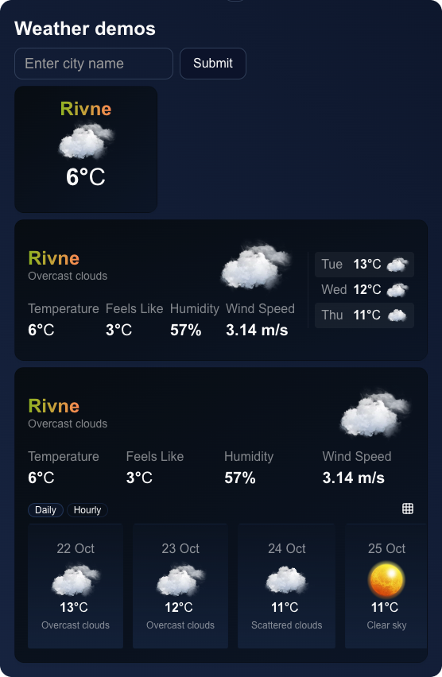

This is a [Next.js](https://nextjs.org) project demonstrating the use of the [OpenWeatherMap API](https://openweathermap.org/api) to display the current weather in a city.
Weather widget adaptively changes its appearance based on the parent container's width.

# Tech Stack
1. Next.js 14
2. TypeScript
3. ShadCN
4. Tailwind CSS with container-queries plugin
5. OpenWeatherMap API

### Live demo https://weather.floatrx.net/



### CSR
Views from `(demo)` group are partially rendered on the client side.

The reason is that from the homepage, we can't determine the path of the page (cityName). Also, at this point, cookies are not available. There is no reason to render the page on the server side or to render it on the server and then hydrate it on the client side.

### SSR
Views `[cityName]` are rendered on the server side.
After the first visit, the app saves the locationInfo in cookies. On subsequent visits, we can determine the required data (cityName, coordinates) from cookies.


## Getting Started

First, run the development server:

```bash
npm run dev
# or
yarn dev
# or
pnpm dev
# or
bun dev
```

Open [http://localhost:3000](http://localhost:3000) with your browser to see the result.

You can start editing the page by modifying `app/page.tsx`. The page auto-updates as you edit the file.

This project uses [`next/font`](https://nextjs.org/docs/app/building-your-application/optimizing/fonts) to automatically optimize and load [Geist](https://vercel.com/font), a new font family for Vercel.

## Learn More

To learn more about Next.js, take a look at the following resources:

-   [Next.js Documentation](https://nextjs.org/docs) - learn about Next.js features and API.
-   [Learn Next.js](https://nextjs.org/learn) - an interactive Next.js tutorial.

You can check out [the Next.js GitHub repository](https://github.com/vercel/next.js) - your feedback and contributions are welcome!

## Deploy on Vercel

The easiest way to deploy your Next.js app is to use the [Vercel Platform](https://vercel.com/new?utm_medium=default-template&filter=next.js&utm_source=create-next-app&utm_campaign=create-next-app-readme) from the creators of Next.js.

Check out our [Next.js deployment documentation](https://nextjs.org/docs/app/building-your-application/deploying) for more details.
